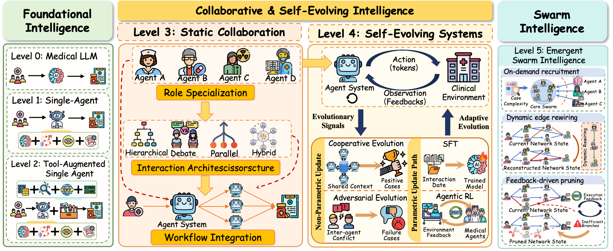

<h1 align="center"> 🤖 Awesome Medical Multi-Agent Systems Survey </h1>

# 🔥 Our Survey Paper

In this survey, we propose a hierarchical taxonomy of medical AI systems from **Level 0** to **Level 5**, tracing the transition from standalone medical models to collaborative, self-evolving, and swarm-like multi-agent systems.

The survey focuses on the architectural shift from **Level 3 static collaboration** to **Level 4 adaptive evolution**: from predefined roles and fixed workflows to systems that iteratively refine their internal strategies through interactive feedback. We also discuss governance mechanisms for safety, reliability, privacy, and clinical trustworthiness.

Looking forward, we envision **Level 5 medical agent swarms**, where agents can be dynamically generated and collaborative topologies can be adaptively reconstructed according to real-world clinical scenarios.

Our summarized taxonomy of LLM-based medical multi-agent systems is shown below:

    
  

 

More details can be found in our survey.

# 📚 Repository Scope

This repository is maintained as a **living paper list** for research on **LLM-based Medical Multi-Agent Systems**. It complements our survey by tracking newly released papers, benchmarks, frameworks, surveys, and related resources.

Following the structure of our survey, the repository organizes papers along the evolutionary trajectory from **foundational medical LLMs and single-agent systems** to **Level 3 static collaboration**, **Level 4 adaptive evolution**, and future **Level 5 medical agent swarms**. It also includes work on knowledge utilization, evaluation, safety governance, and general LLM-based multi-agent systems that offer useful methodological insights for medical AI.

# 🆕 News

[2026/05] This repository is created as a living paper list for LLM-based Medical Multi-Agent Systems. We will continuously update newly released papers and resources. Please feel free to open an issue or submit a pull request if we have missed any relevant work.

# 📌 Table of Contents

- [🔥 Our Survey Paper](#-our-survey-paper)
- [📚 Repository Scope](#-repository-scope)
- [🆕 News](#-news)
- [📌 Table of Contents](#-table-of-contents)
- [🗂️ Paper List for Medical Multi-Agent Systems](#️-paper-list-for-medical-multi-agent-systems)
  - [🧭 1. Related Surveys](#-1-related-surveys)
  - [🧬 2. Foundational Medical LLMs and Single-Agent Systems](#-2-foundational-medical-llms-and-single-agent-systems)
  - [🤝 3. Level 3 Static Medical Multi-Agent Collaboration](#-3-level-3-static-medical-multi-agent-collaboration)
  - [🔄 4. Level 4 Adaptive Evolution](#-4-level-4-adaptive-evolution)
  - [🧠 5. Knowledge Utilization in MMAS](#-5-knowledge-utilization-in-mmas)
  - [📊 6. Benchmarks and Evaluation](#-6-benchmarks-and-evaluation)
  - [🛡️ 7. Safety, Privacy, and Ethics Governance](#️-7-safety-privacy-and-ethics-governance)
  - [🐝 8. Toward Level 5 Medical Agent Swarms and General MAS Inspirations](#-8-toward-level-5-medical-agent-swarms-and-general-mas-inspirations)
- [🤝 Contributing](#-contributing)
- [📬 Contact](#-contact)

# 🗂️ Paper List for Medical Multi-Agent Systems

## 🧭 1. Related Surveys

- **[2025] A comprehensive survey of large language models and multimodal large language models in medicine** (Information Fusion) [[paper]](https://www.sciencedirect.com/science/article/pii/S1566253524006663)
- **[2025] A survey of large language models for healthcare: from data, technology, and applications to accountability and ethics** (Information Fusion) [[paper]](https://www.sciencedirect.com/science/article/pii/S1566253525000363)
- **[2025] A survey of llm-based agents in medicine: How far are we from baymax?** (Findings of ACL) [[paper]](https://aclanthology.org/2025.findings-acl.539/)
- **[2025] Evaluation of medical large language models: taxonomy, review, and directions** (IJCAI) [[paper]](https://ijcai-preprints.s3.us-west-1.amazonaws.com/2025/9158.pdf)
- **[2025] Medical AI Agents: A Comprehensive Survey of Architectures, Cognitive Modules, and Clinical Workflows** (TechRxiv) [[paper]](https://www.techrxiv.org/doi/full/10.36227/techrxiv.176463029.99260745)
- **[2025] Reinventing Clinical Dialogue: Agentic Paradigms for LLM Enabled Healthcare Communication** (Arxiv Preprint) [[paper]](https://arxiv.org/abs/2512.01453)
- **[2025] The rise and potential of large language model based agents: A survey** (Science China Information Sciences) [[paper]](https://link.springer.com/article/10.1007/s11432-024-4222-0)
- **[2024] A survey on LLM-based multi-agent systems: workflow, infrastructure, and challenges** (Vicinagearth) [[paper]](https://link.springer.com/article/10.1007/s44336-024-00009-2)
- **[2024] Large language model based multi-agents: a survey of progress and challenges** (IJCAI) [[paper]](https://www.ijcai.org/proceedings/2024/890)

---

## 🧬 2. Foundational Medical LLMs and Single-Agent Systems

- **[2025] Clinical entity augmented retrieval for clinical information extraction** (NPJ Digital Medicine) [[paper]](https://www.nature.com/articles/s41746-024-01377-1)
- **[2025] Evaluating clinical AI summaries with large language models as judges** (npj Digital Medicine) [[paper]](https://www.nature.com/articles/s41746-025-02005-2)
- **[2023] Med-halt: Medical domain hallucination test for large language models** (CoNLL) [[paper]](https://aclanthology.org/2023.conll-1.21/)

---

## 🤝 3. Level 3 Static Medical Multi-Agent Collaboration

- **[2026] Medla: A logic-driven multi-agent framework for complex medical reasoning with large language models** (AAAI) [[paper]](https://ojs.aaai.org/index.php/AAAI/article/view/37052)
- **[2025] CARE-AD: a multi-agent large language model framework for Alzheimer’s disease prediction using longitudinal clinical notes** (npj Digital Medicine) [[paper]](https://www.nature.com/articles/s41746-025-01940-4)
- **[2025] Colacare: Enhancing electronic health record modeling through large language model-driven multi-agent collaboration** (WWW) [[paper]](https://dl.acm.org/doi/abs/10.1145/3696410.3714877)
- **[2025] Enhancing diagnostic capability with multi-agents conversational large language models** (NPJ Digital Medicine) [[paper]](https://www.nature.com/articles/s41746-025-01550-0)
- **[2025] Evaluation of Multi-Agent LLMs in Multidisciplinary Team Decision-Making for Challenging Cancer Cases** (Machine Learning for Healthcare Conference) [[paper]](https://raw.githubusercontent.com/mlresearch/v298/main/assets/kim25a/kim25a.pdf)
- **[2025] Kg4diagnosis: A hierarchical multi-agent llm framework with knowledge graph enhancement for medical diagnosis** (AAAI Bridge Program on AI for Medicine and Healthcare) [[paper]](https://proceedings.mlr.press/v281/zuo25a.html)
- **[2025] MedARC: Adaptive multi-agent refinement and collaboration for enhanced medical reasoning in large language models** (International Journal of Medical Informatics) [[paper]](https://www.sciencedirect.com/science/article/pii/S1386505625003533)
- **[2025] MoMA: a mixture-of-multimodal-agents architecture for enhancing clinical prediction modelling** (npj Digital Medicine) [[paper]](https://www.nature.com/articles/s41746-025-02219-4)
- **[2025] Code like humans: A multi-agent solution for medical coding** (Cureus) [[paper]](https://aclanthology.org/2025.findings-emnlp.1231/)
- **[2024] Improving multi-agent debate with sparse communication topology** (Findings of EMNLP) [[paper]](https://aclanthology.org/2024.findings-emnlp.427/)
- **[2024] Mdagents: An adaptive collaboration of llms for medical decision-making** (NeurIPS) [[paper]](https://proceedings.neurips.cc/paper_files/paper/2024/hash/90d1fc07f46e31387978b88e7e057a31-Abstract-Conference.html)
- **[2024] Medagents: Large language models as collaborators for zero-shot medical reasoning** (Findings of ACL) [[paper]](https://aclanthology.org/2024.findings-acl.33/)
- **[2024] Mitigating cognitive biases in clinical decision-making through multi-agent conversations using large language models: simulation study** (Journal of Medical Internet Research) [[paper]](https://www.jmir.org/2024/1/e59439/)

---

## 🔄 4. Level 4 Adaptive Evolution

- **[2026] Doctor-R1: Mastering Clinical Inquiry with Experiential Agentic Reinforcement Learning** (ICLR) [[paper]](https://openreview.net/forum?id=vQGHTyL0Jw)
- **[2026] Doctoragent-rl: A multi-agent collaborative reinforcement learning system for multi-turn clinical dialogue** (ICASSP) [[paper]](https://ieeexplore.ieee.org/abstract/document/11460976/)
- **[2026] Empowering AI Data Scientists Using a Multi-Agent LLM Framework with Self-Evolving Capabilities for Autonomous, Tool-Aware Biomedical Data Analyses** (Nature Biomedical Engineering) [[paper]](https://doi.org/10.1038/s41551-026-01634-6)
- **[2026] Language Agents for Hypothesis-driven Clinical Decision Making with Reinforcement Learning** (ICLR) [[paper]](https://openreview.net/forum?id=7vHUQCMAzG)
- **[2026] MedAgentGym: A Scalable Agentic Training Environment for Code-Centric Reasoning in Biomedical Data Science** (ICLR) [[paper]](https://openreview.net/forum?id=jHDZEUgS4r)
- **[2026] MMedAgent-RL: Optimizing Multi-Agent Collaboration for Multimodal Medical Reasoning** (ICLR) [[paper]](https://openreview.net/forum?id=2awntLXwR6)
- **[2026] PatientVLM Meets DocVLM: Pre-Consultation Dialogue Between Vision-Language Models for Efficient Diagnosis** (AAAI) [[paper]](https://doi.org/10.1609/aaai.v40i9.37688)
- **[2026] Model confrontation and collaboration: A debate intelligence framework for enhancing medical reasoning in large language models** (Cell Reports Medicine) [[paper]](https://www.cell.com/cell-reports-medicine/fulltext/S2666-3791(25)00620-2)
- **[2025] WSI-Agents: A Collaborative Multi-agent System for Multi-modal Whole Slide Image Analysis** (MICCAI) [[paper]](https://papers.miccai.org/miccai-2025/1022-Paper0994.html)
- **[2025] Learning to be a doctor: Searching for effective medical agent architectures** (ACM MM) [[paper]](https://dl.acm.org/doi/abs/10.1145/3746027.3755559)
- **[2025] Llms can simulate standardized patients via agent coevolution** (ACL) [[paper]](https://aclanthology.org/2025.acl-long.846/)
- **[2025] MedAgentSim: Self-evolving Multi-agent Simulations for Realistic Clinical Interactions** (MICCAI) [[paper]](https://link.springer.com/chapter/10.1007/978-3-032-05114-1_35)
- **[2025] MedChain: Bridging the Gap Between LLM Agents and Clinical Practice with Interactive Sequence** (NeurIPS) [[paper]](https://proceedings.neurips.cc/paper_files/paper/2025/hash/6bc02900c74234aa5a0c1a7148ed933f-Abstract-Datasets_and_Benchmarks_Track.html)
- **[2025] Mrgagents: A multi-agent framework for improved medical report generation with med-lvlms** (DICTA) [[paper]](https://ieeexplore.ieee.org/abstract/document/11302496/)
- **[2024] Agent hospital: A simulacrum of hospital with evolvable medical agents** (Arxiv Preprint) [[paper]](https://arxiv.org/abs/2405.02957)

---

## 🧠 5. Knowledge Utilization in MMAS

- **[2025] A Knowledge-driven Adaptive Collaboration of LLMs for Enhancing Medical Decision-making** (EMNLP) [[paper]](https://aclanthology.org/2025.emnlp-main.1699/)
- **[2025] Accurate insights, trustworthy interactions: Designing a collaborative ai-human multi-agent system with knowledge graph for diagnosis prediction** (CHI) [[paper]](https://dl.acm.org/doi/abs/10.1145/3706598.3713526)
- **[2025] UCAgents: Unidirectional Convergence for Visual Evidence Anchored Multi-Agent Medical Decision-Making** (Arxiv Preprint) [[paper]](https://arxiv.org/abs/2512.02485)

---

## 📊 6. Benchmarks and Evaluation

- **[2026] Beyond Classification Accuracy: Neural-MedBench and the Need for Deeper Reasoning Benchmarks** (ICLR) [[paper]](https://openreview.net/forum?id=KKA59ai0x6)
- **[2026] CASSIA: A multi-agent large language model for automated and interpretable cell annotation** (Nature Communications) [[paper]](https://www.nature.com/articles/s41467-025-67084-x)
- **[2026] Holistic evaluation of large language models for medical tasks with MedHELM** (Nature Medicine) [[paper]](https://www.nature.com/articles/s41591-025-04151-2)
- **[2026] MedAgentGym: A Scalable Agentic Training Environment for Code-Centric Reasoning in Biomedical Data Science** (ICLR) [[paper]](https://openreview.net/forum?id=jHDZEUgS4r)
- **[2026] Orchestrated multi agents sustain accuracy under clinical-scale workloads compared to a single agent** (npj Health Systems) [[paper]](https://www.nature.com/articles/s44401-026-00077-0)
- **[2026] SMR-Agents: Synergistic medical reasoning agents for zero-shot medical visual question answering with MLLMs** (Information Processing & Management) [[paper]](https://www.sciencedirect.com/science/article/pii/S0306457325002389)
- **[2026] TumorChain: Interleaved Multimodal Chain-of-Thought Reasoning for Traceable Clinical Tumor Analysis** (ICLR) [[paper]](https://openreview.net/forum?id=bmQXN1Kg5i)
- **[2025] 3mdbench: Medical multimodal multi-agent dialogue benchmark** (EMNLP) [[paper]](https://aclanthology.org/2025.emnlp-main.1353/)
- **[2025] Automating expert-level medical reasoning evaluation of large language models** (npj Digital Medicine) [[paper]](https://www.nature.com/articles/s41746-025-02208-7)
- **[2025] Examining the Vulnerability of Multi-Agent Medical Systems to Human Interventions for Clinical Reasoning** (NeurIPS Workshop) [[paper]](https://openreview.net/forum?id=1rngmK4d2c)
- **[2025] Healthbench: Evaluating large language models towards improved human health** (Arxiv Preprint) [[paper]](https://arxiv.org/abs/2505.08775)
- **[2025] LINS: A general medical Q&A framework for enhancing the quality and credibility of LLM-generated responses** (Nature Communications) [[paper]](https://www.nature.com/articles/s41467-025-64142-2)
- **[2025] LLMEval-Med: A Real-world Clinical Benchmark for Medical LLMs with Physician Validation** (Findings of EMNLP) [[paper]](https://aclanthology.org/2025.findings-emnlp.263/)
- **[2025] MedAgentAudit: Diagnosing and Quantifying Collaborative Failure Modes in Medical Multi-Agent Systems** (Arxiv Preprint) [[paper]](https://arxiv.org/abs/2510.10185)
- **[2025] MedAgentBench: A Virtual EHR Environment to Benchmark Medical LLM Agents** (NEJM AI) [[paper]](https://ai.nejm.org/doi/full/10.1056/AIdbp2500144)
- **[2025] MedAgentBoard: Benchmarking Multi-Agent Collaboration with Conventional Methods for Diverse Medical Tasks** (NeurIPS Datasets and Benchmarks Track) [[paper]](https://openreview.net/forum?id=BPpG4qQaNj)
- **[2025] MedAgentSim: Self-evolving Multi-agent Simulations for Realistic Clinical Interactions** (MICCAI) [[paper]](https://papers.miccai.org/miccai-2025/0537-Paper2575.html)
- **[2025] Medagentsbench: Benchmarking thinking models and agent frameworks for complex medical reasoning** (Arxiv Preprint) [[paper]](https://arxiv.org/abs/2503.07459)
- **[2025] Medkgeval: A knowledge graph-based multi-turn evaluation framework for open-ended patient interactions with clinical llms** (Arxiv Preprint) [[paper]](https://arxiv.org/abs/2510.12224)
- **[2025] Medxpertqa: Benchmarking expert-level medical reasoning and understanding** (ICML) [[paper]](https://openreview.net/forum?id=IyVcxU0RKI)
- **[2025] Which Agent Causes Task Failures and When? On Automated Failure Attribution of LLM Multi-Agent Systems** (PMLR) [[paper]](https://openreview.net/forum?id=GazlTYxZss&noteId=cypPlShPMW)
- **[2025] WSI-Agents: A Collaborative Multi-agent System for Multi-modal Whole Slide Image Analysis** (MICCAI) [[paper]](https://papers.miccai.org/miccai-2025/1022-Paper0994.html)
- **[2024] Agentclinic: a multimodal agent benchmark to evaluate ai in simulated clinical environments** (Arxiv Preprint) [[paper]](https://arxiv.org/abs/2405.07960)
- **[2024] MDAgents: An Adaptive Collaboration of LLMs for Medical Decision-Making** (NeurIPS) [[paper]](https://proceedings.neurips.cc/paper_files/paper/2024/hash/90d1fc07f46e31387978b88e7e057a31-Abstract-Conference.html)
- **[2024] MedAgents: Large Language Models as Collaborators for Zero-shot Medical Reasoning** (Findings of ACL) [[paper]](https://aclanthology.org/2024.findings-acl.33/)
- **[2024] Medsafetybench: Evaluating and improving the medical safety of large language models** (NeurIPS) [[paper]](https://proceedings.neurips.cc/paper_files/paper/2024/hash/3ac952d0264ef7a505393868a70a46b6-Abstract-Datasets_and_Benchmarks_Track.html)
- **[2023] Benchmarking large language models on cmexam-a comprehensive chinese medical exam dataset** (NeurIPS) [[paper]](https://proceedings.neurips.cc/paper_files/paper/2023/hash/a48ad12d588c597f4725a8b84af647b5-Abstract-Datasets_and_Benchmarks.html)

---

## 🛡️ 7. Safety, Privacy, and Ethics Governance

- **[2025] An evaluation framework for clinical use of large language models in patient interaction tasks** (Nature Medicine) [[paper]](https://www.nature.com/articles/s41591-024-03328-5)
- **[2025] Architecting Utopias: How AI in Healthcare Envisions Societal Ideals and Human Flourishing** (CHI) [[paper]](https://dl.acm.org/doi/abs/10.1145/3706598.3713118)
- **[2025] Blockchain enabled policy-based access control mechanism to restrict unauthorized access to electronic health records** (PeerJ Computer Science) [[paper]](https://peerj.com/articles/cs-2647/)
- **[2025] Can we trust AI doctors? a survey of medical hallucination in large language and large vision-language models** (Findings of ACL) [[paper]](https://aclanthology.org/2025.findings-acl.350/)
- **[2025] Deidentifying medical documents with local, privacy-preserving large language models: the LLM-anonymizer** (NEJM AI) [[paper]](https://ai.nejm.org/doi/abs/10.1056/AIdbp2400537)
- **[2025] Medsentry: Understanding and mitigating safety risks in medical llm multi-agent systems** (Arxiv Preprint) [[paper]](https://arxiv.org/abs/2505.20824)
- **[2025] Towards fairness-aware and privacy-preserving enhanced collaborative learning for healthcare** (Nature Communications) [[paper]](https://www.nature.com/articles/s41467-025-58055-3)
- **[2024] Augmented non-hallucinating large language models as medical information curators** (NPJ Digital Medicine) [[paper]](https://www.nature.com/articles/s41746-024-01081-0)
- **[2024] Chain-of-verification reduces hallucination in large language models** (Findings of ACL) [[paper]](https://aclanthology.org/2024.findings-acl.212/)
- **[2024] How much decision power should (A) I have?: investigating patients’ preferences towards ai autonomy in healthcare decision making** (CHI) [[paper]](https://dl.acm.org/doi/abs/10.1145/3613904.3642883)
- **[2024] On responsible machine learning datasets emphasizing fairness, privacy and regulatory norms with examples in biometrics and healthcare** (Nature Machine Intelligence) [[paper]](https://www.nature.com/articles/s42256-024-00874-y)
- **[2024] Rethinking human-AI collaboration in complex medical decision making: a case study in sepsis diagnosis** (CHI) [[paper]](https://dl.acm.org/doi/abs/10.1145/3613904.3642343)
- **[2023] Accountability in multi-agent organizations: from conceptual design to agent programming** (Autonomous Agents and Multi-Agent Systems) [[paper]](https://link.springer.com/article/10.1007/s10458-022-09590-6)
- **[2023] Healthcare AI treatment decision support: Design principles to enhance clinician adoption and trust** (CHI) [[paper]](https://dl.acm.org/doi/abs/10.1145/3544548.3581251)
- **[2023] HIPAA and GDPR compliance in IoT healthcare systems** (International Conference on Model and Data Engineering) [[paper]](https://link.springer.com/chapter/10.1007/978-3-031-55729-3_16)
- **[2023] Large language models propagate race-based medicine** (NPJ Digital Medicine) [[paper]](https://www.nature.com/articles/s41746-023-00939-z)
- **[2019] Threat modeling--A systematic literature review** (Computers & Security) [[paper]](https://www.sciencedirect.com/science/article/pii/S0167404818307478)

---

## 🐝 8. Toward Level 5 Medical Agent Swarms and General MAS Inspirations

- **[2025] AFlow: Automating Agentic Workflow Generation** (ICLR) [[paper]](https://proceedings.iclr.cc/paper_files/paper/2025/hash/5492ecbce4439401798dcd2c90be94cd-Abstract-Conference.html)
- **[2024] AutoAgents: A Framework for Automatic Agent Generation** (IJCAI) [[paper]](https://www.ijcai.org/proceedings/2024/3)
- **[2024] GPTSwarm: Language Agents as Optimizable Graphs** (PMLR) [[paper]](https://proceedings.mlr.press/v235/zhuge24a.html)
# 🤝 Contributing

LLM-based medical multi-agent systems are developing rapidly, and this list may miss relevant work. Contributions are welcome. Please feel free to open an issue or submit a pull request if you would like to add papers, benchmarks, frameworks, or other resources.

# 📬 Contact

For questions or suggestions, contact information is anonymized.
